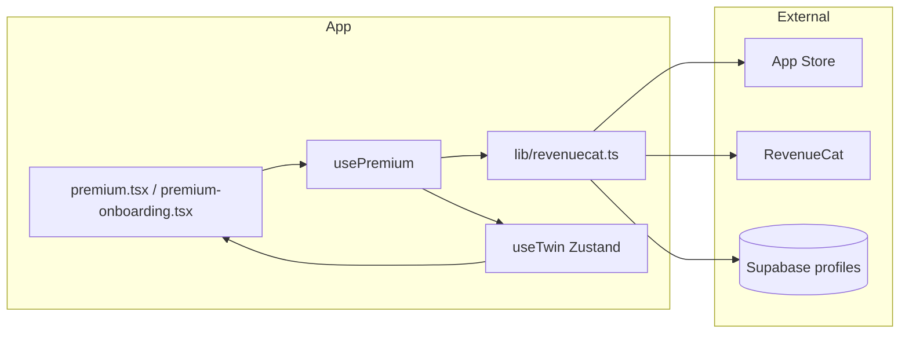

# RevenueCat Integration

How in-app purchases and premium access are wired in this Expo/React Native app.

## Overview

The app uses [RevenueCat](https://www.revenuecat.com/) (`react-native-purchases` v8) as the source of truth for App Store subscriptions and lifetime purchases. Premium status is mirrored to Supabase (`profiles.is_premium`) so feature gates and backend logic can read it without calling RevenueCat on every request.



## Dependencies & configuration

| Piece | Location |
|-------|----------|
| SDK | `react-native-purchases` in `package.json` |
| Apple API key | `app.json` → `expo.extra.revenuecatApiKey` |
| Entitlement | `premium` (checked in code as `premium` or `Premium`) |
| Offerings | RevenueCat “Current” offering; packages resolved by type/identifier in UI |

The service reads the key at runtime:

```typescript
const REVENUECAT_API_KEY = Constants.expoConfig?.extra?.revenuecatApiKey || '';
```

Dashboard setup (products, entitlements, offerings) is documented separately in `PREMIUM_SETUP.md`, `REVENUECAT_APPLE_SETUP.md`, and `COMPLETE_PRICING_SETUP_GUIDE.md`.

## Layer 1: `lib/revenuecat.ts`

Single integration surface for the SDK.

| Function | Role |
|----------|------|
| `initializeRevenueCat(userId?)` | `Purchases.configure({ apiKey })` once; `Purchases.logIn(userId)` when authenticated |
| `getAvailablePackages()` | `Purchases.getOfferings()` → `offerings.current.availablePackages` |
| `purchasePackage(pkg)` | `Purchases.purchasePackage`; returns `CustomerInfo` or `null` on cancel/error |
| `restorePurchases()` | `Purchases.restorePurchases()` |
| `getCustomerInfo()` | Latest `CustomerInfo` |
| `isPremiumActive(customerInfo)` | True if active entitlements include `premium` |
| `syncPremiumStatus(userId, isPremium)` | Writes `profiles.is_premium` in Supabase |
| `getPremiumStatusFromSupabase(userId)` | Reads cached flag |
| `checkAndSyncPremiumStatus(userId)` | Main status resolver (see below) |

`isConfigured` guards lazy init so any API call can trigger configuration if the app hasn’t logged in yet.

## Layer 2: Status resolution (`checkAndSyncPremiumStatus`)

Order of checks:

1. **`BYPASS_REVENUECAT_FOR_TESTING`** — If `true`, only Supabase is used (must stay `false` for App Store builds).
2. **Supabase override** — If `profiles.is_premium` is already `true`, return `true` without overwriting (manual QA / grants).
3. **RevenueCat** — Initialize if needed, `getCustomerInfo()`, `isPremiumActive()`.
4. **Sync** — If RevenueCat says premium, set Supabase `is_premium` to `true` (does not clear premium when RC says false, to preserve overrides).
5. **Fallback** — On error, read Supabase only.

RevenueCat is authoritative for real purchases; Supabase is cache + override for testing and server-side use.

## Layer 3: `hooks/usePremium.ts`

React hook used on paywall screens. When `user` exists:

1. `initializeRevenueCat(user.id)`
2. `checkAndSyncPremiumStatus(user.id)` → `useTwin.setPremium`
3. `getAvailablePackages()` → local `packages` state

Exposes:

- `purchase(pkg)` — purchase → entitlement check → `syncPremiumStatus` → `setPremium` → Mixpanel `PREMIUM_PURCHASE_*`
- `restore()` — restore → sync → Mixpanel `PREMIUM_RESTORED`
- `refreshPremiumStatus()` — re-run `checkAndSyncPremiumStatus`

## Layer 4: `store/useTwin.ts`

Global `isPremium` and `premiumLoading` live in Zustand so any screen can gate features without importing RevenueCat.

- `checkPremiumStatus(userId)` — calls `checkAndSyncPremiumStatus`, updates `isPremium`, sets Mixpanel `is_premium`
- `setPremium` — used by `usePremium` after purchase/restore

Most feature code only reads `const { isPremium } = useTwin()`.

## App lifecycle

**Root layout** (`app/_layout.tsx`): when `user.id` is set, `checkPremiumStatus(user.id)` runs so premium state is fresh on launch.

**Paywall UI**:

- `app/premium.tsx` — main subscription screen
- `app/premium-onboarding.tsx` — onboarding paywall

Both use `usePremium()`. Package selection maps UI options to RevenueCat packages by product id / package type, e.g.:

- Weekly: `mora_weekly_sub`, `$rc_weekly`, `WEEKLY`
- Lifetime: `mora_lifetime_v2`, `$rc_lifetime`, `NON_CONSUMABLE`

**Other entry points**: `profile.tsx` and `account-settings.tsx` refresh premium; `app/index.tsx` routes non-premium users to premium onboarding when appropriate.

## Feature gating (examples)

Screens and components branch on `useTwin().isPremium`, not on RevenueCat directly:

- Simulations (`app/simulate/[id].tsx`, timeline year limits)
- Career sim (`components/career-sim/*`, cooldown hook)
- 2026 predictions (best/worst case)
- What-if, recommendations, home tab upsell
- Credits bypass in `lib/storage.ts` when `isPremium` is true

## Analytics

Purchase and restore flows in `usePremium` emit Mixpanel events (`PREMIUM_PURCHASE_COMPLETED`, `PREMIUM_PURCHASE_FAILED`, `PREMIUM_RESTORED`) and set user property `is_premium`. Payment details stay in RevenueCat/App Store, not Mixpanel.

## Testing

| Approach | How |
|----------|-----|
| StoreKit sandbox | Real RC flow with sandbox Apple ID |
| Supabase override | Set `profiles.is_premium = true` for a user; respected before RC check |
| Full bypass | Set `BYPASS_REVENUECAT_FOR_TESTING = true` in `lib/revenuecat.ts` (dev only) |

## File map

| File | Responsibility |
|------|----------------|
| `lib/revenuecat.ts` | SDK wrapper, entitlement check, Supabase sync |
| `hooks/usePremium.ts` | Paywall hook: init, packages, purchase, restore |
| `store/useTwin.ts` | Global `isPremium`, launch-time `checkPremiumStatus` |
| `app/_layout.tsx` | Premium check on auth |
| `app/premium.tsx` | Paywall UI |
| `app/premium-onboarding.tsx` | Onboarding paywall |
| `app.json` | RevenueCat public API key |

## Related docs

- `PREMIUM_SETUP.md` — setup checklist and troubleshooting
- `REVENUECAT_APPLE_SETUP.md` — App Store Connect + RC dashboard steps
- `TECHNICAL_DOCUMENTATION.md` — broader architecture section on RevenueCat
